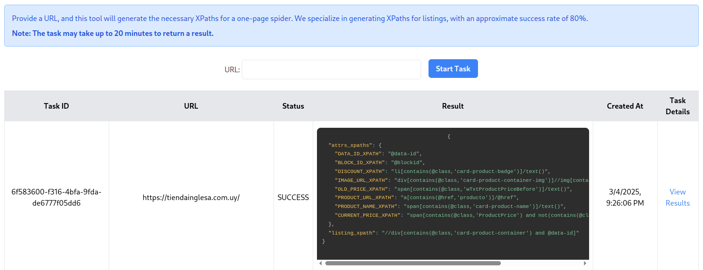

<h1 align="center">Generate Scrapy Spiders with AI.</h1>

[](https://github.com/carlosplanchon/spidercreator/stargazers)
[](https://discord.gg/EgXeu9qnrR)
[](https://services.carlosplanchon.com/spidercreator)
[](https://x.com/carlosplanchon)

<p align="center"><strong>Automated web scraping spider generation using Browser Use and LLMs.<br>
Generate scrapy spiders with minimal technical expertise.</strong></p>

<h1 align="center">THIS LIBRARY IS HIGHLY EXPERIMENTAL</h1>

## Rationale

Extracting data with LLMs is expensive. Spider Creator offers an alternative where LLMs are only used for the spider creation process, and the spiders themselves can then run using traditional methods, which are very cheap.
This tradeoff makes it ideal for users seeking affordable, recurring scraping tasks.

## Costs:
We don't have benchmarks yet. However, in internal tests using GPT, initial figures show a cost of around $2.50 per page. If you need to create a spider that takes into account two types of pages (for example, product listings and product details), this would cost around $5.

## 🚀 Quick Start

#### We recommend using Python 3.11.

⚠️ This package is not on PyPI yet. To get started, clone the repo and run your code from its main folder:
  
```bash
git clone https://github.com/carlosplanchon/spidercreator.git
cd spidercreator
pip install -r requirements.txt
```

Install Playwright: 
```bash
playwright install chromium
```

Export your Google Gemini API KEY and your OpenAI API KEY:

```bash
export GOOGLE_API_KEY=...
export OPENAI_API_KEY=...
```

Generate your Scrapy spider:

```python
from spidercreator import create_spider
from prompts.listings import PRODUCT_LISTING_TASK_PROMPT

# Uruguayan supermarket with product listings:
url = "https://tiendainglesa.com.uy/"

# PRODUCT_LISTING_TASK_PROMPT is a prompt to guide the extraction
# of sample product data from a web homepage,
# optionally following links to product detail pages.
browser_use_task = PRODUCT_LISTING_TASK_PROMPT.format(url=url)

# This function generates a spider
# and saves it to results/<task_id>/spider_code.py
task_id: str = create_spider(url=url, browser_use_task=browser_use_task)
```

Result:

```python
from playwright.sync_api import sync_playwright
from parsel import Selector

import prettyprinter

prettyprinter.install_extras()


class TiendaInglesaScraper:
    def __init__(self, base_url):
        self.base_url = base_url

    def fetch(self, page, url):
        page.goto(url)
        page.wait_for_load_state('networkidle')
        return page.content()

    def parse_homepage(self, html_content, page):
        selector = Selector(text=html_content)
        product_containers = selector.xpath("//div[contains(@class,'card-product-container')]")

        products = []

        for container in product_containers:
            product = {}

            product['name'] = container.xpath(".//span[contains(@class,'card-product-name')]/text()").get('').strip()
            relative_link = container.xpath(".//a/@href").get()
            product['link'] = self.base_url.rstrip('/') + relative_link if relative_link else None
            product['discount'] = container.xpath(".//ul[contains(@class,'card-product-promo')]//li[contains(@class,'card-product-badge')]/text()").get('').strip()
            product['price_before'] = container.xpath(".//span[contains(@class,'wTxtProductPriceBefore')]/text()").get('').strip()
            product['price_after'] = container.xpath(".//span[contains(@class,'ProductPrice')]/text()").get('').strip()

            if product['link']:
                detailed_html = self.fetch(page, product['link'])
                detailed_attrs = self.parse_product_page(detailed_html)
                product.update(detailed_attrs)

            print("--- PRODUCT ---")
            prettyprinter.cpprint(product)

            products.append(product)

        return products

    def parse_product_page(self, html_content):
        selector = Selector(text=html_content)

        detailed_attributes = {}

        detailed_attributes['description'] = selector.xpath("//span[contains(@class, 'ProductDescription')]/text()").get('').strip()

        return detailed_attributes


if __name__ == "__main__":
    base_url = 'https://www.tiendainglesa.com.uy/'

    scraper = TiendaInglesaScraper(base_url)

    with sync_playwright() as p:
        browser = p.chromium.launch(headless=False)
        page = browser.new_page()

        homepage_html = scraper.fetch(page, base_url)
        products_data = scraper.parse_homepage(homepage_html, page)

        browser.close()

    for idx, product in enumerate(products_data, 1):
        print(f"\nProduct {idx}:")
        for key, value in product.items():
            print(f"{key.title().replace('_', ' ')}: {value}")
```

### Examples

Find practical usage examples in the [examples folder](examples/).

## Hosted version
💡 <strong>Looking for a tested and reliable version? We host a specialized build focused on extracting price listing XPaths from homepages - with an 80% success rate.</strong>  
👉 **[Try the custom-build hosted version ☁︎](https://services.carlosplanchon.com/spidercreator)**



## ⚙️ How It Works

### Main Workflow

The user provides a prompt describing the desired task or data.
1. The system opens a browser and performs the task based on the prompt.
2. The browser activity is recorded during the session.
3. The recorded activity is passed to the Spider Creator.
4. The Spider Creator generates a web scraper (spider) from the recorded actions.

### Spider Creator Algorithm

Steps:
1. Load Browser Use recordings.
2. Generate mindmap to visualize web navigation process.
3. Make a multi-stage plan on how to generate xpaths.
4. For each stage of the plan:
    1. Given the website HTML, generate a compressed & chunked DOM representation.
    2. Traverse the compressed DOM chunk by chunk, select Regions of Interest, and generate candidate spiders based on the intention described in the planning stage.
    3. Execute candidate spiders in a virtual execution enviroment (ctxexec)
    4. Verify execution results and select the best candidate spider for this stage.
5. Combine spiders from each stage into a final spider.
6. Save spider code and return task_id.

## Contributing

We love contributions! Feel free to open issues for bugs or feature requests.

<div align="center">
Made with ❤️ in Dolores, Uruguay!
 </div>
